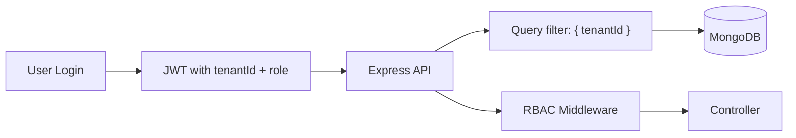
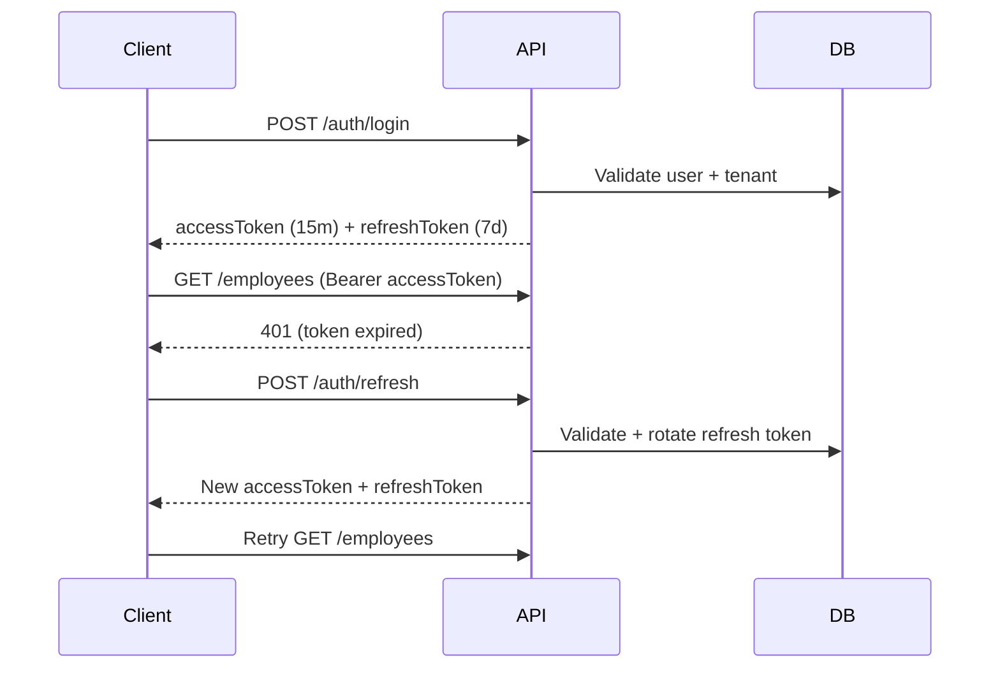

# Architecture — Workforce SaaS

## Overview

This is a **multi-tenant workforce management platform** where multiple organizations (tenants) share one application instance but their data is strictly isolated.



## Multi-Tenant Architecture

### Strategy: Shared Database, Shared Schema

All tenants use the same MongoDB database and collections. Isolation is enforced by a `tenantId` field on every tenant-scoped document.

| Collection      | tenantId | Notes                    |
| --------------- | -------- | ------------------------ |
| tenants         | N/A      | Organization registry    |
| users           | Yes      | Login scoped to tenant   |
| employees       | Yes      | Workforce records        |
| payroll         | Yes      | Pay records              |
| refreshTokens   | Yes      | Auth tokens              |

### Tenant Context Flow

1. User logs in with `email + password + tenantSlug`
2. Backend validates credentials against `users` where `email` AND `tenantId` match
3. JWT payload includes `tenantId`, `role`, `permissions`
4. `authenticate` middleware decodes JWT and sets `req.tenantId`
5. `tenantMiddleware` ensures tenant context exists
6. All service queries include `{ tenantId: req.tenantId }`

**Key file:** `backend/src/middleware/auth.js`, `backend/src/middleware/tenant.js`

### Why Not Subdomain-per-Tenant?

For this demo we use tenant slug at login. Production systems may use:
- Subdomain (`acme.app.com`)
- Custom domain mapping
- `X-Tenant-Id` header for API clients

The isolation principle remains: **tenantId in every query**.

## RBAC Design

### Model

```
User → Role → Permissions → Resources
```

| Role           | Permissions                                         |
| -------------- | --------------------------------------------------- |
| tenant_admin   | employees:*, payroll:*, settings:read, tenants:read |
| hr_manager     | employees:read, employees:write, payroll:read     |
| employee       | employees:read:self, payroll:read:self              |

### Enforcement Layers

1. **Backend (authoritative):** `requirePermission()` middleware on every route
2. **Frontend (UX only):** `PermissionGate` component hides UI — never trusted for security

**Key files:**
- `backend/src/constants/permissions.js` — role-to-permission mapping
- `backend/src/middleware/rbac.js` — permission check middleware
- `frontend/src/components/PermissionGate.tsx` — UI gate

### Wildcard Permissions

`employees:*` grants all `employees:` prefixed permissions. Implemented in `roleHasPermission()`.

## Authentication

### JWT Access + Refresh Token Flow



- Access token: short-lived, sent in `Authorization` header
- Refresh token: stored in DB, rotatable, sent in body/cookie
- Axios interceptor auto-refreshes on 401

**Key files:**
- `backend/src/services/authService.js`
- `frontend/src/api/client.ts`

## Frontend State Architecture

| State Type     | Tool           | Examples                    |
| -------------- | -------------- | --------------------------- |
| Server state   | React Query    | employees, payroll, tenants |
| Client state   | Redux Toolkit  | auth session, UI sidebar    |
| HTTP transport | Axios          | interceptors, base URL      |

### Why This Split?

- **React Query** handles caching, refetching, loading/error for API data
- **Redux** handles auth tokens and UI preferences that persist across routes
- Interview answer: *"API data → React Query; auth/theme → Redux"*

## Performance Patterns

| Technique              | Location                                      |
| ---------------------- | --------------------------------------------- |
| Code splitting         | `frontend/src/routes/AppRoutes.tsx` (lazy)    |
| Virtualized lists      | `EmployeeTable.tsx` (@tanstack/react-virtual) |
| Memoized rows          | `EmployeeRow.tsx` (React.memo)                |
| Debounced search       | `useDebounce` hook                            |
| Query cache tuning     | `constants/index.ts` staleTime/gcTime           |

## Folder Structure Principles

### Frontend (SRP)

- `features/` — domain-specific pages and components
- `components/` — reusable UI primitives
- `queries/` — React Query hooks only
- `store/` — Redux slices only
- `api/` — HTTP client and endpoint definitions
- `constants/` — magic strings centralized
- `utils/` — pure helper functions

### Backend (SRP)

- `controllers/` — HTTP request/response handling
- `services/` — business logic
- `models/` — Mongoose schemas
- `middleware/` — cross-cutting concerns
- `routes/` — route definitions with middleware chains

## Security Checklist

- [x] Passwords hashed with bcrypt (cost 12)
- [x] JWT secrets in environment variables
- [x] CORS restricted to CLIENT_URL
- [x] Helmet security headers
- [x] Tenant isolation on all queries
- [x] RBAC on all protected routes
- [x] Refresh token rotation and revocation
- [x] Input validation with express-validator
